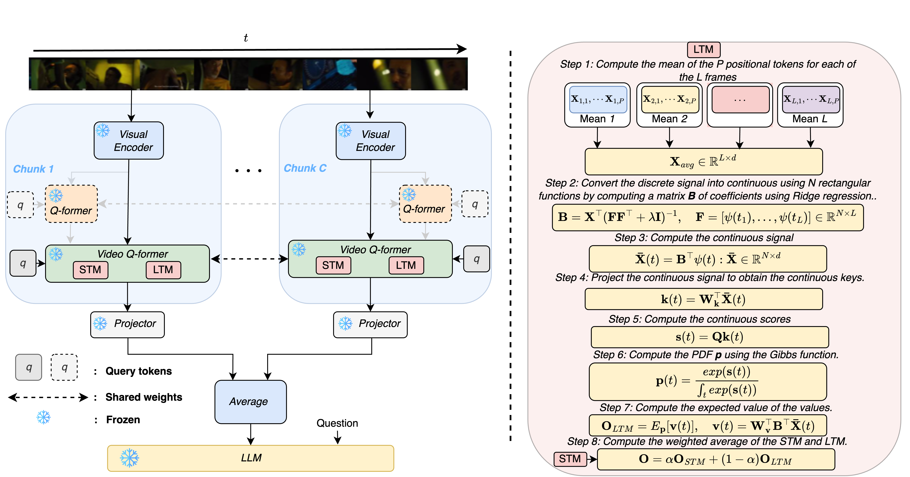

# Infinite-Video
# $\infty$-Video: A Training-Free Approach to Long Video Understanding via Continuous-Time Memory Consolidation
Official implementation of the paper **$\infty$-Video: A Training-Free Approach to Long Video Understanding via Continuous-Time Memory Consolidation**.

*Saul Santos*, *António Farinhas*, *Daniel McNamee* and *André Martins*

<p align="center">
  
</p>
**Abstract**: *Current video-language models struggle with long-video understanding due to limited context lengths and reliance on sparse frame subsampling, often leading to information loss.
This paper introduces ∞-Video, which can process arbitrarily long videos through a continuous-time long-term memory (LTM) consolidation mechanism. Our framework augments video Q-formers by allowing them to process unbounded video contexts efficiently and without requiring additional training. 
Through continuous attention, our approach dynamically allocates higher granularity to the most relevant video segments, forming ``sticky'' memories that evolve over time. 
Experiments with Video-LLaMA and VideoChat2 demonstrate improved performance in video question-answering tasks, showcasing the potential of continuous-time LTM mechanisms to enable scalable and training-free comprehension of long videos.*

----------

**If you use this code in your work, please cite our paper.**

----------

## Resources

- [Paper](to add) (arXiv)

All material is made available under the MIT license. You can **use, redistribute, and adapt** the material for **non-commercial purposes**, as long as you give appropriate credit by **citing our paper** and **indicating any changes** that you've made.


## Video LLaMA
### Python requirements and installation

This code was tested on `Python 3.10.10`. To install, follow the steps of [moviechat](https://github.com/rese1f/MovieChat)

### Reproducibility
1 - Run ```eval_code/extract_features``` on the intended dataset with the desired number of frames.

2 - Run each script in ```eval_code/eval``` with the hyperparameters mentioned in the paper:
Example: 
```
 python3 eval_code/eval/run_inference_inf_video_llama_nextqa.py     --cfg-path eval_configs/infvideollama.yaml     --num-beams 1   --temperature 1 --video-folder next_qa/features --q-folder /mnt/scratch-artemis/saul/next_qa/val.csv     --output-dir /MovieChat/nextqa_val     --max_int 256    --num_basis 256  --tau 0.75  --alpha 1.0 --task inf_video_llama --sticky
```

3 - For open-ended questions run ```eval_code/validate/run_eval_qa_chatgpt.py```with the output of the moviechat script run.

4 - For multiple-choice questions, we predict the answers as open-ended and use langchain to select the most similar option, run ```eval_code/validate/run_eval_langchain.py```with the output from the dataset run script as:

```
python eval_code/validate/run_eval_langchain.py --pred_path egoschema/nframes_8_nchunks_256_moviechatplus/preds.json --num_tasks 100
```

Then compute accuracy with ```run_eval.py```

## VideoChat2
### Python requirements and installation
Follow the instructions of [videochat2](https://github.com/OpenGVLab/Ask-Anything/tree/main/video_chat2)

### Reproducibility
1 - Run each script in ```eval_code``` with the hyperparameters mentioned in the paper:
Example: 
```
 python3 eval_code/run_nextqa_mistral.py  --video-folder  /NExTQA/videos --data_path /next_qa/val.csv --output-dir nextqa_val --max_int 16     --num_samples 8    --num_basis 64  --tau 0.75 --alpha 1.0

```

## Acknowledgment

The experiments in this work benefit from the following open-source codes:
* Enxin Song, Wenhao Chai, Guanhong Wang, Yucheng Zhang, Haoyang Zhou, Feiyang Wu, Haozhe Chi, Xun Guo, Tian Ye, Yanting Zhang, Yan Lu, Jenq-Neng Hwang and Gaoang Wang. MovieChat: From Dense Token to Sparse Memory for Long Video Understanding, CVPR 2024. https://github.com/rese1f/MovieChat
* Kunchang Li, Yali Wang, Yinan He, Yizhuo Li, Yi Wang, Yi Liu, Zun Wang, Jilan Xu, Guo Chen, Guo Chen, Limin Wanga and Yu Qiao. MVBench: A Comprehensive Multi-modal Video Understanding Benchmark, Proceedings of the IEEE/CVF Conference on Computer Vision and Pattern Recognition,  https://github.com/OpenGVLab/Ask-Anything/tree/main/video_chat2
* Pedro Henrique Martins, Zita Marinho, André F. T. Martins, ∞-former: Infinite Memory Transformer, Proc. ACL 2022. https://github.com/deep-spin/infinite-former
